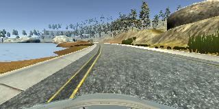
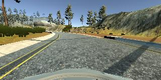
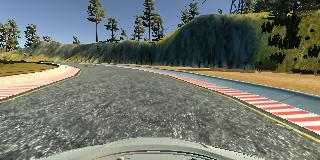
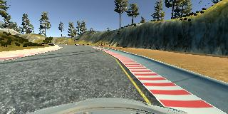
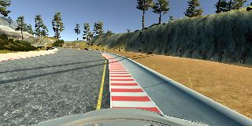

# CarND-Behavioral-Cloning


## Model architecture
I chose a basic convolutional model architecture, consiting of three convolutional layers of increasing 
filter depth alternated with pooling layers, two hidden fully connected
layers with dropout and a final fully connected layer with one output neuron:

```
Input(32,32,1)
CONV(3x3x16)
ELU()
MAXPOOL(2x2)
CONV(3x3x16)
ELU()
MAXPOOL(2x2)
CONV(3x3x16)
ELU()
MAXPOOL(2x2)
FLATTEN()
DENSE(512)
ELU()
DROPOUT(0.5)
DENSE(512)
ELU()
DROPOUT(0.5)
DENSE(1)
```

## Training Data
I recorded five sets of training data that were captured using a game controller while driving on different parts
of the roads (three complete rounds on the course).
The idea is to add an additional offset to the steering angle during training
that will point the car back towards the center of the road.
For all recorded datasets, left/right camera images are used in addition to the center camera image.
* center: Driving in the center of the road (offset: 0).
* lane_left / lane_right: Driving on the left/right side of the road with the wheels just touching the lane lines (offset: +/- 7.5°).
* recovery_left / recovery_right: Driving as far on the edges/side as possible (offset: +/- 15.0°).







## Data Augmentation
The following measures are taken to augment the training data:
* The steering angle is offset for data recorded at the edges of the road as described above.
* A small offset is added for images taken from the left/right cameras (+/- 0.5°).
* The image is rotated by a random angle, picked from a uniform distribution [-7.5°,+7.5°]. The steering angle is adjusted in 
accordingly by subtracting the rotation angle from the steering angle.
* The image is translated by a random delta_x picked from a uniform distribution [-40,40].
The steering angle is adjusted according to the formula: `steering_angle += math.atan2(delta_x , 95.0) * 180.0 / math.pi / 25.0`.
(Here the constant 95.0 is the approximate distance between the horizon and the bottom of the camera image).
* The image is translated by a randm delta_y picked from a uniform distribution [-10,10].
* The image is mirrored horizontally, with a probability of 0.5. Correspondingly, the steering angle is multiplied by -1.0.

## Image Data Preprocessing
* The image is cropped vertically, cutting off the area above the horizon and the bottom area containing the front of the car.
* The image is rescaled non-proportionally to 32x32px sizes, using bicubic interpolation.
* The image is normalized to the value range [0.0,1.0].

## Training Procedure
* The data is split into a training and a validation set of proportions 80/20.
* Batch size is 64, epoch size is 16384.
* I chose the Adam optimizer with an initial learning rate of 0.0001.
* The learning rate is reduced by half whenever the validation loss did not improve over the last four epochs.
* Training data is augmented as described above using a keras generator.

## Driving script (drive.py)
* The image received from the simulator is preprocessed as described above.
* The preprocessed/rescaled image is evaluated by the network, yielding the new steering angle. 
* Throttle is set by a simple control mechanism that aims to keep the speed close to a preset target speed.
* Steering angle/throttle are passed back to the simulator.

